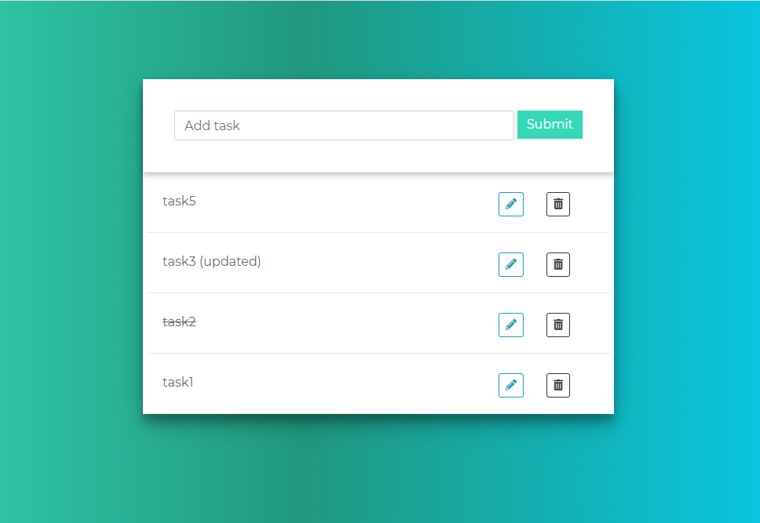

# todo-rest-api

A todo list app built using Django on the backend, and HTML, CSS, Bootstrap, JavaScript, JQuery on the frontend.

It uses AJAX (Asynchronous JavaScript and XML) to make requests to the REST API.

 

   

